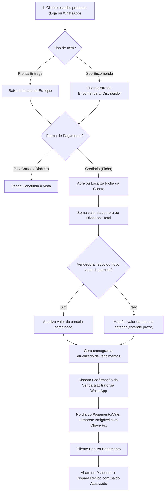

# 🏠 Product Discovery: Gestão Comercial & Crediário Enxovais Gabriel
**Projeto:** Digitalização e Automação de Vendas, Estoque e Crediário Próprio  
**Data:** 22/08/2026  
**Status:** Validado / Refatoração Aprovada  
**Versão:** 2.0  

---

## 1. 🎯 Visão Geral e Declaração de Propósito

O **Enxovais Gabriel** é uma empresa comercial e revendedora especializada em **utilidades domésticas e artigos para o lar** (cama, mesa, banho, colchas, edredons, utensílios de cozinha, itens de decoração e organizadores). 

A empresa **não fabrica produtos artesanalmente**, mas comercializa produtos adquiridos de fabricantes e distribuidores selecionados, combinando:
1. **Vasto Estoque Físico:** Produtos à pronta-entrega para retirada ou entrega imediata.
2. **Vendas sob Encomenda:** Solicitação de itens específicos aos fornecedores sob demanda da cliente.
3. **Crediário Próprio Flexível (Ficha da Cliente):** Venda a prazo em conta-corrente (dividendo acumulado), com parcelas fixas contínuas e vencimento casado com o fluxo financeiro da cliente (dia do pagamento ou dia do vale).
4. **Vendas à Vista e Cartão:** Suporte completo a Pix e Cartão de Débito/Crédito.

> **Declaração de Visão:**  
> *"Permitir que a equipe de vendas e gestão controle com facilidade o estoque de utilidades domésticas, o status de encomendas aos distribuidores e, principalmente, a gestão precisa e humanizada do crediário próprio (fichas), garantindo cobrança sem atritos no dia do pagamento/vale e controle rigoroso do dividendo acumulado."*

---

## 2. 🧩 Contexto do Negócio e Diagnóstico Operacional

### 2.1 Como funciona a rotina comercial:
* **Mix de Produtos:** Variedade ampla de utilidades para o lar (edredons, colchas, jogos de cama, toalhas, panelas, potes herméticos, organizadores, quadros e decoração).
* **Vendas a Pronta Entrega:** Itens disponíveis em estoque são baixados e entregues na hora.
* **Vendas sob Encomenda:** Quando o cliente solicita uma cor, tamanho ou item específico em falta, o pedido é registrado como encomenda e solicitado ao distribuidor.
* **Mecânica do Crediário em Ficha (Dividendo Acumulado):**
  * Cada cliente a prazo possui uma **Ficha de Crediário**.
  * Novas compras são somadas ao **saldo devedor (dividendo)**.
  * **Regra de Parcela Combinada:** O valor da parcela (ex: R$ 100,00) permanece constante mesmo com novas compras, aumentando a quantidade de parcelas (tempo da dívida), exceto quando a vendedora negocia e consegue aumentar o valor da parcela com a cliente.
  * **Dia de Pagamento:** Cada ficha possui um dia fixo de vencimento combinado previamente (geralmente sincronizado com o **dia do pagamento** — ex: dia 05 — ou com o **dia do vale/adiantamento** — ex: dia 20).
* **Comunicação e Cobrança:** Cobrança amigável pelo WhatsApp nas datas de vale/pagamento, emissão de recibo digital com extrato do saldo devedor e avisos de chegada de encomendas.

### 2.2 Principais Dores Mapeadas:
| Dor Identificada | Impacto no Negócio | Severidade |
| :--- | :--- | :---: |
| **Controle de fichas em papel e cálculo de dividendo manual** | Erros de cálculo no saldo devedor acumulado e perda de fichas físicas. | 🔴 Crítica |
| **Esquecimento da data exata de pagamento/vale de cada cliente** | Cobrança no dia errado gerando constrangimento ou perda da janela de recebimento. | 🔴 Crítica |
| **Descontrole entre estoque pronta-entrega e itens encomendados** | Promessas de entrega não cumpridas ou esquecimento de pedir itens ao distribuidor. | 🔴 Crítica |
| **Falta de clareza do cliente sobre o saldo restante na ficha** | Dúvidas constantes do cliente sobre quanto já pagou e quanto ainda deve. | 🟡 Média |
| **Tempo gasto calculando parcelas ao adicionar novas compras** | Lentidão no fechamento da venda e risco de recalcular errado a data final. | 🟡 Média |

---

## 3. 👥 Personas e Stakeholders

### Persona 1: Lucelia / Vendedora & Gestora Comercial
* **Perfil:** Atua no atendimento direto, negociação de vendas e acompanhamento de cobranças.
* **Ambiente de Uso:** Smartphone e computador no balcão da loja ou em rota de entrega.
* **Necessidade:**
  - Buscar rapidamente a ficha da cliente por nome ou WhatsApp.
  - Adicionar nova compra ao dividendo com 2 cliques, mantendo o valor da parcela fixa ou reajustando quando negociado.
  - Saber exatamente quais clientes têm vencimento hoje (dia do pagamento ou dia do vale).
  - Registrar recebimentos (parciais ou totais) e emitir recibo instantâneo no WhatsApp.
  - Acompanhar encomendas que chegaram do distribuidor.

### Persona 2: Cliente da Loja (Consumidora Doméstica)
* **Perfil:** Compra utilidades para a casa e enxovais, valoriza a relação de confiança do crediário próprio.
* **Comportamento:** Paga religiosamente na data do seu pagamento ou do vale adiantamento.
* **Necessidade:**
  - Transparência sobre o total do dividendo e quantas parcelas faltam.
  - Lembrete delicado e respeitoso na data acordada com chave Pix facilitada.
  - Recibo claro via WhatsApp sempre que fizer um pagamento: *"Você pagou R$ 100, seu novo saldo restante é R$ 350"*.

---

## 4. 💡 Proposta de Valor e Regras de Ouro do Crediário

1. **Conta Corrente de Crediário Transparente:** Todas as compras (débitos) e pagamentos (créditos) formam um extrato auditável da ficha da cliente.
2. **Manutenção Automática de Parcela:** Ao lançar nova compra a prazo, o sistema soma o valor ao dividendo e recalcula o número de parcelas restantes com base no valor da parcela já combinado. A vendedora pode alterar o valor da parcela caso tenha feito uma renegociação.
3. **Sincronização com Fluxo de Renda da Cliente:** Campo explícito na ficha para o dia de vencimento e tipo de ciclo (`MENSAL_PAGAMENTO`, `QUINZENAL_VALE`).
4. **Gestão de Encomendas Integrada:** Rastreio dos itens que estão no estoque físico vs itens solicitados aos distribuidores.

---

## 5. 🔄 Fluxo Operacional: Venda, Crediário e Cobrança

---

## 6. 🎯 Métricas de Sucesso (KPIs)

1. **Taxa de Recebimento no Dia do Vale/Pagamento:** Aumento de 35% no cumprimento das datas acordadas graças aos lembretes automáticos pontuais.
2. **Tempo de Registro de Venda a Prazo:** Menos de 30 segundos para lançar nova compra no dividendo da cliente.
3. **Precisão de Estoque e Encomendas:** 100% de rastreabilidade de pedidos pendentes com fornecedores.
4. **Satisfação e Fidelização:** Zero ruídos ou desentendimentos sobre valores de saldo devedor e parcelas.
