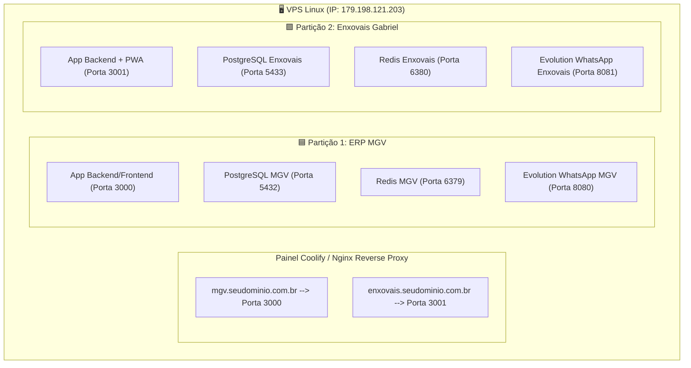

# 🏢 Particionamento e Coexistência Multi-Projetos na Mesma VPS
**VPS IP:** `179.198.121.203`  
**Painel Coolify:** `http://179.198.121.203:8000`  
**Projetos Hospedados:** `MGV-ERP` + `Enxovais Gabriel`  

---

## 🎯 1. Visão de Isolamento na Mesma VPS

Para que os dois sistemas (ERP MGV e Enxovais Gabriel) rodem simultaneamente no mesmo servidor sem colisões, cada aplicação tem sua própria **partição lógica (Stack Docker / Projeto Coolify)** 100% isolada:



---

## 🔢 2. Tabela de Portas & Nomes Isolados

| Recurso | Partição MGV (Existente) | Partição Enxovais Gabriel (Nova) | Status |
| :--- | :--- | :--- | :---: |
| **Nome da Stack** | `mgv-erp` | `enxovais-gabriel` | ✅ Isolado |
| **Rede Docker Bridge** | `mgv_network` | `enxoval_network` | ✅ Isolado |
| **Porta Externa Aplicação** | `3000` | `3001` | ✅ Sem Conflito |
| **Porta Externa PostgreSQL** | `5432` | `5433` | ✅ Sem Conflito |
| **Porta Externa Redis** | `6379` | `6380` | ✅ Sem Conflito |
| **Porta Externa Evolution API** | `8080` | `8081` | ✅ Sem Conflito |
| **Nome da Instância WhatsApp** | Instância da MGV | `enxovais_gabriel` | ✅ Instância Própria |
| **Volume de Dados do Banco** | `mgv_postgres_data` | `postgres_data` (namespaced) | ✅ 100% Separado |

---

## 🚀 3. Como Ativar a Partição da Enxovais Gabriel na VPS

### Opção A: Pelo Terminal da VPS (Docker Compose)
1. Conecte-se na VPS via SSH:
   ```bash
   ssh root@179.198.121.203
   ```
2. Crie a pasta da nova partição:
   ```bash
   mkdir -p /root/enxovais-gabriel && cd /root/enxovais-gabriel
   ```
3. Envie os arquivos do projeto da Enxovais Gabriel para essa pasta e execute:
   ```bash
   cp .env.example .env
   docker compose up -d --build
   ```

### Opção B: Pelo Painel do Coolify
1. Acesse o Coolify em: `http://179.198.121.203:8000`
2. No menu **Projects**, clique em **+ New Project** e nomeie como **"Enxovais Gabriel"**.
3. Adicione um **Docker Compose Resource** apontando para o arquivo `docker-compose.yml` da Enxovais.
4. Defina as variáveis de ambiente baseadas no `.env.example` e clique em **Deploy**.
